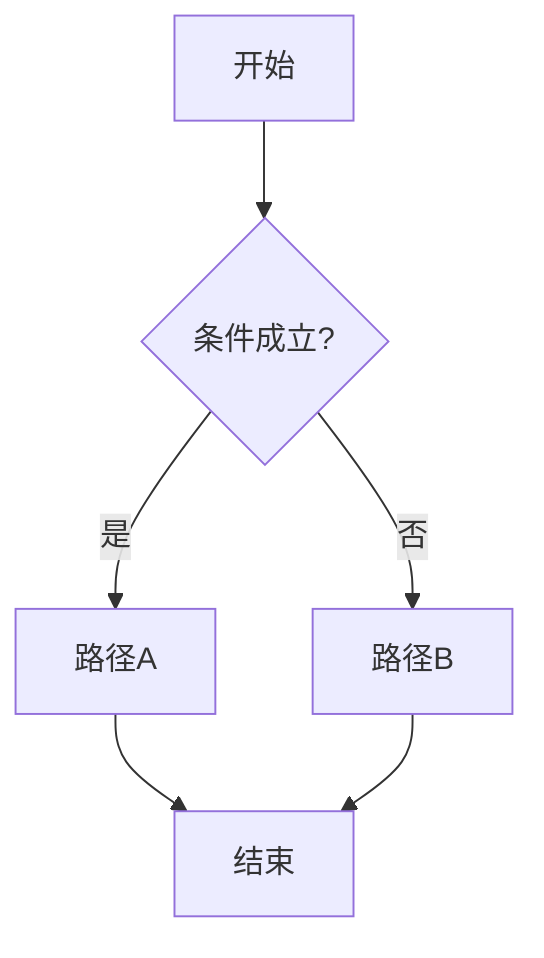
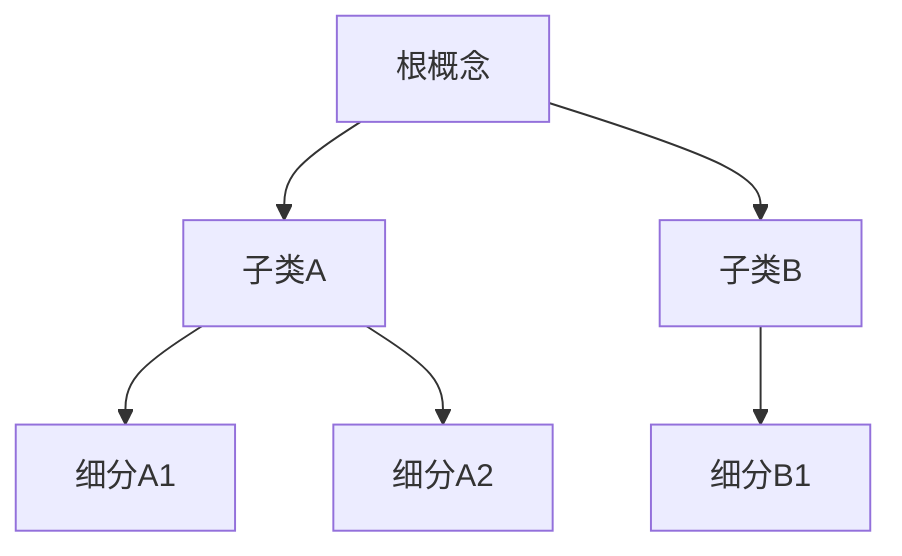
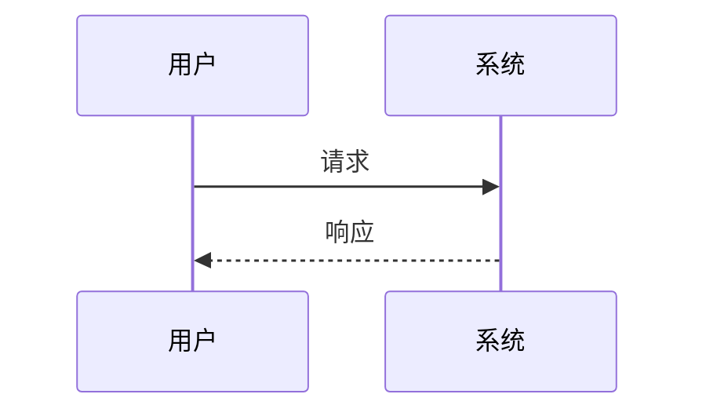

# 可视化武器库 (visual_arsenal.md)

> Phase 2 生成正文时**必须**按需加载本文件。  
> 目标：除「搜图插入」和「表格」之外，提供**有限、可渲染、格式统一**的图示手段；AI 可灵活选用，但**不得自创未登记语法**（否则浏览器渲染会崩或每期长得不一样）。

---

## 0. 核心原则

1. **只准用登记过的武器**：下表 Type ID 以外的写法一律禁止（含随意 HTML、任意 SVG、未约定的 mermaid 方言）。  
2. **先选武器再写内容**：每个图示前必须写声明注释（见 §2）。  
3. **一种图一种写法**：同类型图示全项目同一套 fence / class，禁止「这期用 ASCII、下期用 SVG」。  
4. **能表则表、能图则图**：对比用矩阵表；过程用流程图；层级用树；结构关系用框图；实景才用照片。  
5. **前端契约优先**：本文件 + `frontend_spec.md` §Visual 是验收标准；迁入阅读器时必须实现全部 Tier A/B。

---

## 1. 武器总表（按场景选用）

| Type ID | 名称 | 最适合解释什么 | Tier | 语法载体 |
| :--- | :--- | :--- | :--- | :--- |
| `photo` | 实景/实物照片 | 真实物体、场景、仪器外观 | A | `imageQuery` + `` |
| `table` | 对比/参数表 | 并排对比、参数、分类清单 | A | GFM 表格 |
| `steps` | 有序步骤 | 操作顺序、算法步骤（无分支） | A | 有序列表 + 可选 `div.viz-steps` |
| `callout` | 便利贴/提示盒 | 警告、数据、公式要点、误区 | A | `div.sticky-note` 变体 |
| `flow` | 流程图 | 过程、分支、决策、管道 | B | ` ```mermaid ` flowchart |
| `tree` | 树状图 | 分类层级、知识树、解剖层级 | B | ` ```mermaid ` flowchart TD / mindmap |
| `seq` | 时序图 | A 与 B 谁先谁后、协议往返 | B | ` ```mermaid ` sequenceDiagram |
| `state` | 状态图 | 状态机、生命周期 | B | ` ```mermaid ` stateDiagram-v2 |
| `blocks` | 工程框图 | 模块/接口/数据流（方框+箭头） | A | `div.viz-blocks` 固定 HTML |
| `svg-lite` | 轻量工程图 | 简单示意（杠杆、电路块、解剖示意轮廓） | B | `div.viz-svg` + **白名单 SVG** |
| `formula` | 公式块 | 方程、比例、记谱式文字转写 | A | `div.viz-formula` 或行内 `$…$`（若前端启用） |

**Tier A**：仅需现有 Markdown/HTML 白名单即可渲染。  
**Tier B**：阅读器必须加载约定库（Mermaid）或实现 SVG 沙箱；未实现前 AI **仍按本规范写入**，并在文首注明「需 Tier B 阅读器」。

---

## 2. 强制声明头（每个图示前一行）

```markdown
<!-- visual: flow | id: F01 | title: 诊断分流 | purpose: 说明何时走路径A/B -->
```

| 字段 | 规则 |
| :--- | :--- |
| `visual` | 必须是 §1 的 Type ID |
| `id` | 本篇内唯一，如 `F01` `T02` `B01` |
| `title` | 短标题，与下方可见标题一致 |
| `purpose` | 一句话：这图在教什么 |

无声明头的图示 = 不合格（`validate_content.js` 可检测 mermaid/viz 块）。

---

## 3. 选用决策树（给 AI）

```
要解释的东西是什么？
├─ 两个以上概念并排对比？ → table
├─ 纯线性步骤、无分支？ → steps
├─ 有分支/循环/判断？ → flow
├─ 上下级分类/组成？ → tree
├─ 多方随时间交互？ → seq
├─ 对象有几种状态来回切？ → state
├─ 系统由模块+接口组成？ → blocks（优先）或 flow
├─ 需要近似真实的几何/结构示意？ → svg-lite（保持极简）或 photo
├─ 需要实物照片？ → photo
└─ 只要强调一句要点/数据/误区？ → callout
```

**禁止**：用 `photo` 硬凑「概念关系」；用大段散文代替本该用的 `flow`/`tree`。

---

## 4. 各武器严格写法

### 4.1 `photo`（已有，重申）

```markdown
<!-- visual: photo | id: P01 | title: … | purpose: … -->
<!-- imageQuery: "person + action + object 3-6 words" | target: "slug.jpg" -->

```

- 概念图不够时：优先改用 `blocks`/`flow`，不要狂搜抽象图。

### 4.2 `table`

```markdown
<!-- visual: table | id: T01 | title: A vs B | purpose: … -->

#### A vs B
| 维度 | A | B |
| :--- | :--- | :--- |
| … | … | … |
```

### 4.3 `steps`

```markdown
<!-- visual: steps | id: S01 | title: 操作顺序 | purpose: … -->
<div class="viz-steps" data-viz-id="S01">
<ol>
  <li><strong>Step 1 — 名称</strong>：一句话</li>
  <li><strong>Step 2 — 名称</strong>：一句话</li>
</ol>
</div>
```

### 4.4 `callout`（sticky 变体）

| class | 用途 |
| :--- | :--- |
| `sticky-note` | 一般提示 |
| `sticky-note science-note` | 数据 / 文献 / 证据 |
| `sticky-note warn-note` | 误区 / 危险操作 |
| `sticky-note formula-note` | 公式要点 |

```html
<!-- visual: callout | id: C01 | title: … | purpose: … -->
<div class="sticky-note warn-note">
  <h4>标题</h4>
  <p>短内容。可 <strong>强调</strong>。禁止 ___、MCQ、嵌套 sticky。</p>
</div>
```

### 4.5 `flow` / `tree` / `seq` / `state`（Mermaid — 唯一允许的图代码方言）

**硬性约束：**

- 必须用围栏：\`\`\`mermaid … \`\`\`  
- 第一行声明图种类（`flowchart` / `sequenceDiagram` / `stateDiagram-v2` / `mindmap`）  
- 节点 ID：`[A-Za-z][A-Za-z0-9_]*`，短标签  
- **禁止**：`click`、`javascript`、HTML 注入、`init:` 主题覆盖、超过 **20** 个节点（太大就拆成两图）  
- 方向：流程图默认 `TD`（上→下）或 `LR`（左→右）；树状分类优先 `TD`  
- 中文标签允许，但避免特殊字符破坏解析：不用 `"` 嵌套，少用 `()` 冲突时改用 `[]`

**流程图示例：**

````markdown
<!-- visual: flow | id: F01 | title: 分流 | purpose: … -->

````

**树状图（用 flowchart 模拟，兼容性最好）：**

````markdown
<!-- visual: tree | id: R01 | title: 分类树 | purpose: … -->

````

> 可选：`mindmap`（若前端 Mermaid 版本支持）。不支持时退回 flowchart TD。

**时序图：**

````markdown
<!-- visual: seq | id: Q01 | title: 交互顺序 | purpose: … -->

````

### 4.6 `blocks`（工程框图 — 不依赖 Mermaid）

用于「模块 + 箭头 + 接口」类工程图，**固定 HTML 结构**，禁止改 class 名。

```html
<!-- visual: blocks | id: B01 | title: 系统框图 | purpose: … -->
<div class="viz-blocks" data-viz-id="B01" data-orientation="LR">
  <div class="viz-blocks-row">
    <div class="viz-block">
      <div class="viz-block-title">模块A</div>
      <div class="viz-block-body">职责一句话</div>
    </div>
    <div class="viz-arrow" aria-hidden="true">→</div>
    <div class="viz-block viz-block-accent">
      <div class="viz-block-title">模块B</div>
      <div class="viz-block-body">职责一句话</div>
    </div>
    <div class="viz-arrow" aria-hidden="true">→</div>
    <div class="viz-block">
      <div class="viz-block-title">输出</div>
      <div class="viz-block-body">结果</div>
    </div>
  </div>
  <p class="viz-caption">图 B01：一句话读图说明</p>
</div>
```

| 规则 | 说明 |
| :--- | :--- |
| 单行模块数 | ≤ 5；更多则拆第二行 `viz-blocks-row` |
| 允许 class | 仅 `viz-blocks` / `viz-blocks-row` / `viz-block` / `viz-block-accent` / `viz-arrow` / `viz-caption` / `viz-block-title` / `viz-block-body` |
| 禁止 | 内联 `style=`、嵌套 `viz-blocks`、在 block 内放填空/MCQ |

`data-orientation`：`LR`（默认）或 `TD`（前端用 CSS 换纵向）。

### 4.7 `svg-lite`（轻量工程示意）

仅当 `blocks`/`flow` 表达不了几何关系时使用。

```html
<!-- visual: svg-lite | id: V01 | title: … | purpose: … -->
<div class="viz-svg" data-viz-id="V01">
  <svg xmlns="http://www.w3.org/2000/svg" viewBox="0 0 320 180" width="100%" height="auto" role="img" aria-label="…">
    <!-- 仅允许: svg,g,line,polyline,polygon,rect,circle,ellipse,path,text,title -->
    <rect x="20" y="60" width="80" height="40" rx="4" class="viz-svg-node"/>
    <line x1="100" y1="80" x2="160" y2="80" class="viz-svg-edge"/>
    <text x="40" y="85" class="viz-svg-label">A</text>
  </svg>
  <p class="viz-caption">图 V01：…</p>
</div>
```

**SVG 白名单（强制）：**

- 允许标签：`svg, g, line, polyline, polygon, rect, circle, ellipse, path, text, title, desc`  
- 允许属性：几何类 + `class` + `viewBox` + `xmlns` + `role` + `aria-label`  
- **禁止**：`<script>`、`onclick`、`foreignObject`、外部 URL、`xlink:href` 除 `#` 锚点、任意 `style` 属性（用 class：`viz-svg-node|edge|label|muted`）  
- path 复杂度：单个 path 的 `d` 建议 < 500 字符；整图元素 < 40  

### 4.8 `formula`

```html
<!-- visual: formula | id: M01 | title: … | purpose: … -->
<div class="viz-formula" data-viz-id="M01">
  <div class="viz-formula-main">a² + b² = c²</div>
  <div class="viz-formula-note">用白话：…</div>
</div>
```

若前端启用 KaTeX/MathJax，可额外支持行内 `$...$` / 块 `$$...$$`；**未启用前**只用 `viz-formula` 纯文本，避免裸 `$` 造成半渲染。

---

## 5. 密度与排版纪律

| 规则 | 值 |
| :--- | :--- |
| 单篇 Magazine 单篇正文图示 | 建议 1–3 个；全期合计 ≤ 10 |
| 单 Unit | 建议 2–5 个 |
| 连续两个 mermaid | 中间必须有一段说明文字 |
| 图下说明 | `blocks`/`svg-lite`/`photo` 建议有 `viz-caption` 或 alt |
| 与练习隔离 | 图示容器内禁止 `___`、`[Your Answer]`、MCQ |

---

## 6. 阅读器渲染契约（写入 frontend_spec 的摘要）

| Type | 前端必须做什么 |
| :--- | :--- |
| mermaid 围栏 | 用 Mermaid 渲染；统一主题（禁止作者改 `init`）；失败时显示源码+错误，不空白崩页 |
| viz-blocks | CSS 实现横/纵向；小屏自动换行 |
| viz-svg | 保留 SVG；class 着色；沙箱去掉非法标签 |
| sticky 变体 | warn-note / formula-note 有独立样式 |
| viz-steps / viz-formula | 固定排版 |

**崩溃防护：**

- Mermaid 渲染包在 try/catch；单图失败不影响全文  
- 非法 HTML 标签在消毒阶段剥离  
- 不执行用户/模型写入的任何脚本  

---

## 7. Phase 2 自检（生成后）

```
[ ] 每个图示都有 <!-- visual: ... --> 声明头
[ ] Type ID 均在武器表内
[ ] mermaid 节点 ≤20，无 click/script
[ ] blocks/svg 只用白名单 class/标签
[ ] 图示内无填空/MCQ
[ ] 选型符合 §3 决策树（不是全用 photo）
```
