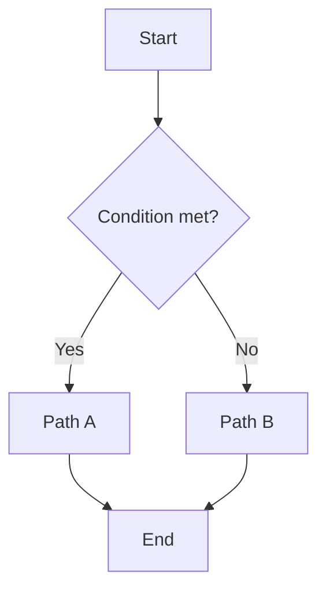
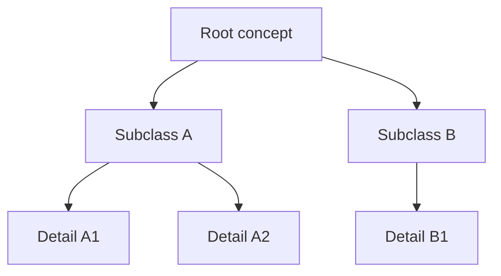
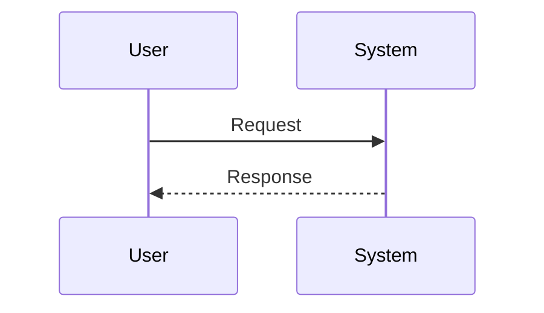

# Visual Arsenal (visual_arsenal.md)

> **Must** load on demand when Phase 2 generates body content.  
> Goal: beyond “search-and-insert photos” and “tables”, provide a **finite, renderable, format-unified** diagram toolkit. The AI may choose freely among registered types, but **must not invent unregistered syntax** (otherwise the browser breaks or every issue looks different).

---

## 0. Core principles

1. **Registered weapons only**: anything outside the Type IDs below is banned (arbitrary HTML, arbitrary SVG, unagreed Mermaid dialects).  
2. **Pick the weapon before writing**: every diagram needs a declaration comment first (see §2).  
3. **One type, one syntax**: same diagram type uses the same fence / class across the project — no “ASCII this week, SVG next week”.  
4. **Table when contrast; diagram when structure**: contrasts → matrix tables; process → flow; hierarchy → tree; structural relations → blocks; real scenes → photos.  
5. **Frontend contract wins**: this file + `frontend_spec.md` §Visual are the acceptance standard; readers must implement all Tier A/B.

---

## 1. Weapon table (pick by scenario)

| Type ID | Name | Best for explaining | Tier | Carrier |
| :--- | :--- | :--- | :--- | :--- |
| `photo` | Real / object photo | Real objects, scenes, instrument appearance | A | `imageQuery` + `` |
| `table` | Contrast / parameter table | Side-by-side contrast, params, classification lists | A | GFM table |
| `steps` | Ordered steps | Operation order, algorithm steps (no branches) | A | Ordered list + optional `div.viz-steps` |
| `callout` | Sticky / tip box | Warnings, data, formula points, pitfalls | A | `div.sticky-note` variants |
| `flow` | Flowchart | Process, branches, decisions, pipelines | B | \`\`\`mermaid flowchart |
| `tree` | Tree | Classification hierarchy, knowledge tree, anatomy layers | B | \`\`\`mermaid flowchart TD / mindmap |
| `seq` | Sequence | Who acts when, protocol round-trips | B | \`\`\`mermaid sequenceDiagram |
| `state` | State | State machines, lifecycles | B | \`\`\`mermaid stateDiagram-v2 |
| `blocks` | Engineering block diagram | Modules / interfaces / data flow (boxes + arrows) | A | Fixed HTML `div.viz-blocks` |
| `svg-lite` | Lightweight engineering sketch | Simple sketches (lever, circuit block, anatomy outline) | B | `div.viz-svg` + **whitelisted SVG** |
| `formula` | Formula block | Equations, ratios, notation as text | A | `div.viz-formula` or inline `$…$` (if frontend enables) |

**Tier A**: Existing Markdown/HTML whitelist is enough.  
**Tier B**: Reader must load agreed libraries (Mermaid) or SVG sandbox; before that, AI **still writes to this spec** and notes at the top “requires Tier B reader”.

---

## 2. Mandatory declaration header (one line before each diagram)

```markdown
<!-- visual: flow | id: F01 | title: Diagnostic triage | purpose: when to take path A/B -->
```

| Field | Rule |
| :--- | :--- |
| `visual` | Must be a §1 Type ID |
| `id` | Unique in this piece, e.g. `F01` `T02` `B01` |
| `title` | Short title, matches the visible title below |
| `purpose` | One sentence: what this diagram teaches |

Diagrams without a declaration header = fail (`validate_content.js` can detect mermaid/viz blocks).

---

## 3. Selection decision tree (for AI)

```
What are you explaining?
├─ Two+ concepts side by side? → table
├─ Pure linear steps, no branches? → steps
├─ Branches / loops / decisions? → flow
├─ Parent/child classification / composition? → tree
├─ Multiple parties over time? → seq
├─ Object switches among states? → state
├─ System of modules + interfaces? → blocks (prefer) or flow
├─ Need approximate geometry / structure? → svg-lite (keep minimal) or photo
├─ Need a real photo? → photo
└─ Just emphasize one tip / data / pitfall? → callout
```

**Banned**: using `photo` to fake “concept relations”; using long prose where `flow`/`tree` belongs.

---

## 4. Strict syntax per weapon

### 4.1 `photo` (existing, restated)

```markdown
<!-- visual: photo | id: P01 | title: … | purpose: … -->
<!-- imageQuery: "person + action + object 3-6 words" | target: "slug.jpg" -->

```

- If a concept diagram is insufficient: prefer `blocks`/`flow` over flooding abstract photo searches.

### 4.2 `table`

```markdown
<!-- visual: table | id: T01 | title: A vs B | purpose: … -->

#### A vs B
| Dimension | A | B |
| :--- | :--- | :--- |
| … | … | … |
```

### 4.3 `steps`

```markdown
<!-- visual: steps | id: S01 | title: Operation order | purpose: … -->
<div class="viz-steps" data-viz-id="S01">
<ol>
  <li><strong>Step 1 — Name</strong>: one sentence</li>
  <li><strong>Step 2 — Name</strong>: one sentence</li>
</ol>
</div>
```

### 4.4 `callout` (sticky variants)

| class | Use |
| :--- | :--- |
| `sticky-note` | General tip |
| `sticky-note science-note` | Data / literature / evidence |
| `sticky-note warn-note` | Pitfall / dangerous action |
| `sticky-note formula-note` | Formula key points |

```html
<!-- visual: callout | id: C01 | title: … | purpose: … -->
<div class="sticky-note warn-note">
  <h4>Title</h4>
  <p>Short content. May <strong>emphasize</strong>. No ___, MCQ, nested sticky.</p>
</div>
```

### 4.5 `flow` / `tree` / `seq` / `state` (Mermaid — only allowed diagram code dialect)

**Hard constraints:**

- Must use fence: \`\`\`mermaid … \`\`\`  
- First line declares kind (`flowchart` / `sequenceDiagram` / `stateDiagram-v2` / `mindmap`)  
- Node IDs: `[A-Za-z][A-Za-z0-9_]*`, short labels  
- **Banned**: `click`, `javascript`, HTML injection, `init:` theme overrides, more than **20** nodes (split if larger)  
- Direction: flowcharts default `TD` (top→bottom) or `LR` (left→right); classification trees prefer `TD`  
- Non-English labels are allowed, but avoid special chars that break parsing: no nested `"`, prefer `[]` when `()` conflicts

**Flowchart example:**

````markdown
<!-- visual: flow | id: F01 | title: Triage | purpose: … -->

````

**Tree (flowchart simulation — best compatibility):**

````markdown
<!-- visual: tree | id: R01 | title: Classification tree | purpose: … -->

````

> Optional: `mindmap` (if frontend Mermaid supports it). Fall back to flowchart TD if not.

**Sequence:**

````markdown
<!-- visual: seq | id: Q01 | title: Interaction order | purpose: … -->

````

### 4.6 `blocks` (engineering block diagram — no Mermaid)

For “module + arrow + interface” engineering diagrams. **Fixed HTML structure**; do not rename classes.

```html
<!-- visual: blocks | id: B01 | title: System block diagram | purpose: … -->
<div class="viz-blocks" data-viz-id="B01" data-orientation="LR">
  <div class="viz-blocks-row">
    <div class="viz-block">
      <div class="viz-block-title">Module A</div>
      <div class="viz-block-body">One-line duty</div>
    </div>
    <div class="viz-arrow" aria-hidden="true">→</div>
    <div class="viz-block viz-block-accent">
      <div class="viz-block-title">Module B</div>
      <div class="viz-block-body">One-line duty</div>
    </div>
    <div class="viz-arrow" aria-hidden="true">→</div>
    <div class="viz-block">
      <div class="viz-block-title">Output</div>
      <div class="viz-block-body">Result</div>
    </div>
  </div>
  <p class="viz-caption">Figure B01: one-line reading guide</p>
</div>
```

| Rule | Note |
| :--- | :--- |
| Modules per row | ≤ 5; more → second `viz-blocks-row` |
| Allowed classes | Only `viz-blocks` / `viz-blocks-row` / `viz-block` / `viz-block-accent` / `viz-arrow` / `viz-caption` / `viz-block-title` / `viz-block-body` |
| Banned | Inline `style=`, nested `viz-blocks`, blanks/MCQ inside blocks |

`data-orientation`: `LR` (default) or `TD` (frontend CSS for vertical).

### 4.7 `svg-lite` (lightweight engineering sketch)

Only when `blocks`/`flow` cannot express geometry.

```html
<!-- visual: svg-lite | id: V01 | title: … | purpose: … -->
<div class="viz-svg" data-viz-id="V01">
  <svg xmlns="http://www.w3.org/2000/svg" viewBox="0 0 320 180" width="100%" height="auto" role="img" aria-label="…">
    <!-- Allowed only: svg,g,line,polyline,polygon,rect,circle,ellipse,path,text,title -->
    <rect x="20" y="60" width="80" height="40" rx="4" class="viz-svg-node"/>
    <line x1="100" y1="80" x2="160" y2="80" class="viz-svg-edge"/>
    <text x="40" y="85" class="viz-svg-label">A</text>
  </svg>
  <p class="viz-caption">Figure V01: …</p>
</div>
```

**SVG whitelist (mandatory):**

- Allowed tags: `svg, g, line, polyline, polygon, rect, circle, ellipse, path, text, title, desc`  
- Allowed attrs: geometry + `class` + `viewBox` + `xmlns` + `role` + `aria-label`  
- **Banned**: `<script>`, `onclick`, `foreignObject`, external URLs, `xlink:href` except `#` anchors, arbitrary `style` (use classes: `viz-svg-node|edge|label|muted`)  
- Path complexity: single path `d` preferably < 500 chars; whole diagram < 40 elements  

### 4.8 `formula`

```html
<!-- visual: formula | id: M01 | title: … | purpose: … -->
<div class="viz-formula" data-viz-id="M01">
  <div class="viz-formula-main">a² + b² = c²</div>
  <div class="viz-formula-note">In plain words: …</div>
</div>
```

If frontend enables KaTeX/MathJax, inline `$...$` / block `$$...$$` may also be supported; **before that**, use plain-text `viz-formula` only — bare `$` causes half-renders.

---

## 5. Density & layout discipline

| Rule | Value |
| :--- | :--- |
| Diagrams per Magazine article | Suggest 1–3; whole issue ≤ 10 |
| Per Unit | Suggest 2–5 |
| Two consecutive mermaid | Must have explanatory prose between |
| Captions | `blocks`/`svg-lite`/`photo` should have `viz-caption` or alt |
| Isolate from exercises | No `___`, `[Your Answer]`, MCQ inside diagram containers |

---

## 6. Reader render contract (summary for frontend_spec)

| Type | Frontend must |
| :--- | :--- |
| mermaid fence | Render with Mermaid; unified theme (authors must not override via `init`); on failure show source + error — never blank crash |
| viz-blocks | CSS horizontal/vertical; wrap on small screens |
| viz-svg | Keep SVG; class coloring; sandbox strips illegal tags |
| sticky variants | Distinct styles for warn-note / formula-note |
| viz-steps / viz-formula | Fixed layout |

**Crash protection:**

- Mermaid render in try/catch; one failed diagram must not break the page  
- Illegal HTML stripped at sanitize time  
- Never execute scripts written by user/model  

---

## 7. Phase 2 self-check (after generation)

```
[ ] Every diagram has <!-- visual: ... --> declaration
[ ] All Type IDs are in the weapon table
[ ] mermaid nodes ≤20, no click/script
[ ] blocks/svg use only whitelisted classes/tags
[ ] No blanks/MCQ inside diagrams
[ ] Selection matches §3 decision tree (not all photo)
```
