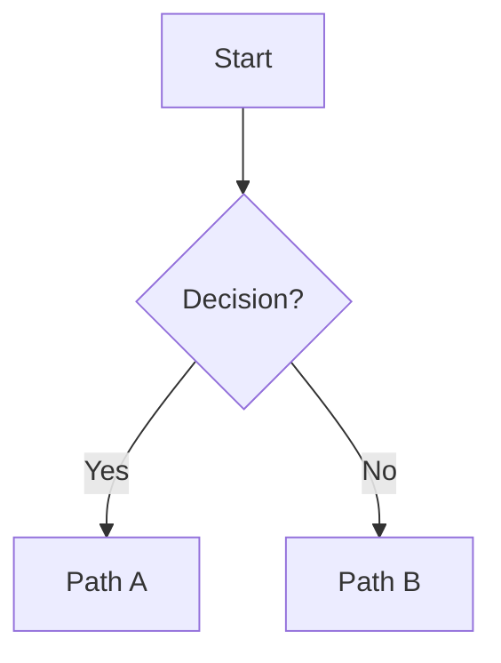

# Magazine.NN Content Skeleton (template)

> Copy this structure when generating; replace bracketed content. Do not treat this skeleton as a real issued issue.

```markdown
# [Subject] Learning Magazine

## Magazine.NN: [issue title]

*Theme: [one-line theme]*

---

### Block 1: Articles

#### Article A: "[hook-style title]"

<!-- imageQuery: "concrete scene 3-6 words" | target: "magazineNN_feature.jpg" -->


[Hook opening paragraph — never start with a definition dump]

##### [Informative subhead 1]
…
##### [Subhead 2]

<!-- visual: flow | id: F01 | title: Process triage | purpose: show critical branches -->


<!-- visual: blocks | id: B01 | title: Module relations | purpose: engineering overview -->
<div class="viz-blocks" data-viz-id="B01" data-orientation="LR">
  <div class="viz-blocks-row">
    <div class="viz-block"><div class="viz-block-title">Input</div><div class="viz-block-body">…</div></div>
    <div class="viz-arrow" aria-hidden="true">→</div>
    <div class="viz-block viz-block-accent"><div class="viz-block-title">Core</div><div class="viz-block-body">…</div></div>
    <div class="viz-arrow" aria-hidden="true">→</div>
    <div class="viz-block"><div class="viz-block-title">Output</div><div class="viz-block-body">…</div></div>
  </div>
  <p class="viz-caption">Figure B01: reading guide</p>
</div>
##### [Subhead 3]
…

##### 📚 Key Ideas from This Article

| Concept | Plain meaning | Memory hook | In-context line |
| :--- | :--- | :--- | :--- |
| **term** | … | … | "…" |
| **term** 🔁 | … | … | "…" |

<div class="sticky-note">
  <h4>Data / literature sticky</h4>
  <p>[Verifiable data or guideline name; if unsure mark “needs verification”]</p>
</div>

---

#### Article B: "…"
(same structure)

#### Article C: "…"
(same structure)

---

### Block 2: How Do I Apply This?

**Scenario card 1**
- Situation: …
- Common wrong approach: …
- Better approach: …
- Why: …

**Scenario card 2**
…

---

### Block 3: [warehouse theme name]

…

---

### Block 4: Quick Check (optional, ≤5)

#### MCQ-1
Stem: …
- [ ] A. …
- [ ] B. …
- [ ] C. …
- [ ] D. …
<!-- answer: B | rationale: … -->

#### TF-1
Statement: …
- [ ] True
- [ ] False
<!-- answer: False | flaw: … -->

---

> When done, highlight uncertain spots and annotate; then say “grade my work”.
```
