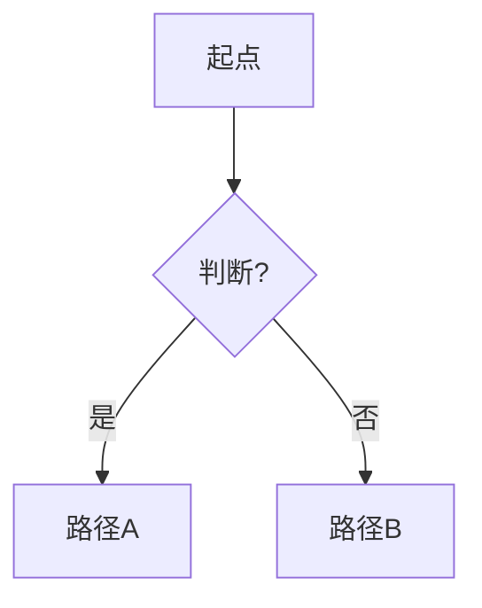

# Magazine.NN 内容骨架（样板）

> 生成时复制结构，替换方括号内容。不要把本样板当成真实期号发行。

```markdown
# [Subject] Learning Magazine

## Magazine.NN: [期刊标题]

*Theme: [一句话主题]*

---

### Block 1: Articles

#### Article A: "[钩子式标题]"

<!-- imageQuery: "concrete scene 3-6 words" | target: "magazineNN_feature.jpg" -->


[钩子开场段落 —— 禁止定义体开头]

##### [有信息量的副标题 1]
…
##### [副标题 2]

<!-- visual: flow | id: F01 | title: 过程分流 | purpose: 展示关键分支 -->


<!-- visual: blocks | id: B01 | title: 模块关系 | purpose: 工程结构一览 -->
<div class="viz-blocks" data-viz-id="B01" data-orientation="LR">
  <div class="viz-blocks-row">
    <div class="viz-block"><div class="viz-block-title">输入</div><div class="viz-block-body">…</div></div>
    <div class="viz-arrow" aria-hidden="true">→</div>
    <div class="viz-block viz-block-accent"><div class="viz-block-title">核心</div><div class="viz-block-body">…</div></div>
    <div class="viz-arrow" aria-hidden="true">→</div>
    <div class="viz-block"><div class="viz-block-title">输出</div><div class="viz-block-body">…</div></div>
  </div>
  <p class="viz-caption">图 B01：读图说明</p>
</div>
##### [副标题 3]
…

##### 📚 Key Ideas from This Article

| Concept | Plain meaning | Memory hook | In-context line |
| :--- | :--- | :--- | :--- |
| **term** | … | … | "…" |
| **term** 🔁 | … | … | "…" |

<div class="sticky-note">
  <h4>数据 / 文献便利贴</h4>
  <p>[可核验的数据或指南名；不确定则标「需核验」]</p>
</div>

---

#### Article B: "…"
（同上结构）

#### Article C: "…"
（同上结构）

---

### Block 2: How Do I Apply This?

**情景卡 1**
- 情境：…
- 常见错误做法：…
- 更合理做法：…
- 为什么：…

**情景卡 2**
…

---

### Block 3: [warehouse 主题名]

…

---

### Block 4: Quick Check（可选，≤5）

#### MCQ-1
Stem：…
- [ ] A. …
- [ ] B. …
- [ ] C. …
- [ ] D. …
<!-- answer: B | rationale: … -->

#### TF-1
命题：…
- [ ] True
- [ ] False
<!-- answer: False | flaw: … -->

---

> 读完请高亮不确定处并注释；完成后说「帮我批改」。
```
