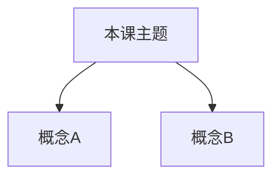

# Unit.NN 内容骨架（样板）

> 生成时复制结构。本样板不计入已发行进度。

```markdown
# Unit.NN: [标题]

> 目标：学完能 [可检验行为]。关联 domain 节点：[…]

---

## Part 0: Cold Start Recall

不看笔记，回答：
1. …
2. …

*   **[Your Answer]**:

---

## Part 1: Core Concepts

### 1. [概念名]
- 定义：…
- 为何重要：…
- 易混：… vs …
- Plain Option（可选）：…

<!-- visual: tree | id: R01 | title: 本课概念树 | purpose: 建立层级 -->


### 2. [概念名]
…

---

## Part 2: Guided Questions

1. …
*   **[Your Answer]**:

2. …
*   **[Your Answer]**:

---

## Part 3: Guided Case

Case: …
Mentor: …
You: ___ (✏️ …)
Mentor: …
You: ___ (✏️ …)

---

## Part 4: Objective Checks

#### MCQ-1
Stem：…
- [ ] A. …
- [ ] B. …
- [ ] C. …
- [ ] D. …
<!-- answer: A | rationale: … -->

#### MCQ-2
…

#### TF-1
命题：…
- [ ] True
- [ ] False
<!-- answer: True | flaw: … -->

#### TF-2
…

---

## Part 5: Application Write-up

用自己的话解释 / 解决：
*   **[Your Answer]** (✏️ 6–10 句或分点亦可):

---

## Part 6: Submit

完成后说「帮我批改」。批改结束后若 AI 询问是否加练，只有你明确同意后才会再出题。
```
