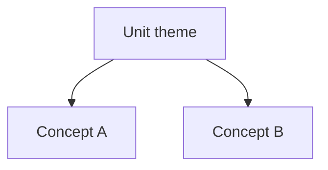

# Unit.NN Content Skeleton (template)

> Copy this structure when generating. This skeleton does not count as issued progress.

```markdown
# Unit.NN: [title]

> Goal: after this unit you can [testable behavior]. Related domain nodes: […]

---

## Part 0: Cold Start Recall

Without notes, answer:
1. …
2. …

*   **[Your Answer]**:

---

## Part 1: Core Concepts

### 1. [Concept name]
- Definition: …
- Why it matters: …
- Easy to confuse: … vs …
- Plain Option (optional): …

<!-- visual: tree | id: R01 | title: This unit concept tree | purpose: build hierarchy -->


### 2. [Concept name]
…

---

## Part 2: Guided Questions

1. …
*   **[Your Answer]**:

2. …
*   **[Your Answer]**:

---

## Part 3: Guided Case

Case: …
Mentor: …
You: ___ (✏️ …)
Mentor: …
You: ___ (✏️ …)

---

## Part 4: Objective Checks

#### MCQ-1
Stem: …
- [ ] A. …
- [ ] B. …
- [ ] C. …
- [ ] D. …
<!-- answer: A | rationale: … -->

#### MCQ-2
…

#### TF-1
Statement: …
- [ ] True
- [ ] False
<!-- answer: True | flaw: … -->

#### TF-2
…

---

## Part 5: Application Write-up

Explain / solve in your own words:
*   **[Your Answer]** (✏️ 6–10 sentences or bullets OK):

---

## Part 6: Submit

When done, say “grade my work”. After grading, if the AI asks about extra drills, new items appear only after you clearly agree.
```
